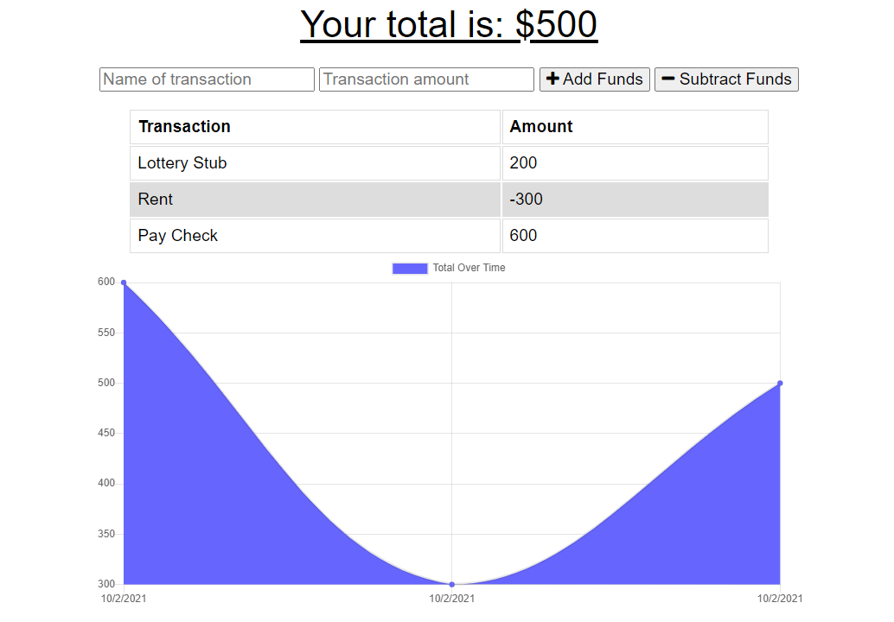

## Challenge Nineteen Budget Tracker PWA

### Description
For this challenge we were tasked with converting an existing budget tracking app to a Progressive Web App, which means it has some functions that are available even if the app isn't connected to the internet, and makes an effort to cache existing files while still having the appearance of a native app. 

This was accomplished by adding indexDB functionality which has the ability to store sent requests within the browser until online functionality is restored, resulting in a seemless user expirience. Likwise the PWA aspect was added by including a service worker javascript file to cache existing files within the app, and a manifest.json which provided information for insalling the app on a mobile device. 

### Screenshots

The following is an example of what the Budget Tracker looks like when viewed in a browser

### Links
Live Site: [Link](https://thawing-taiga-10295.herokuapp.com/)
Github: [Link](https://github.com/LoganDufek/PWA-BudgetTracker)